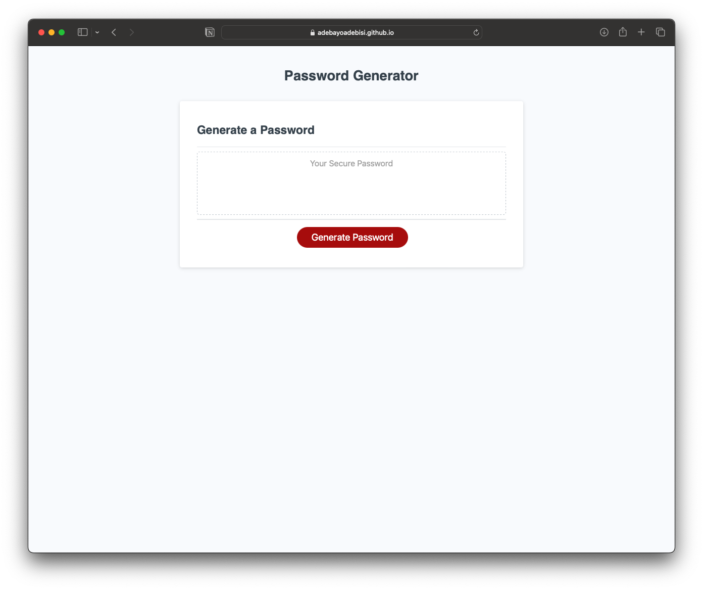
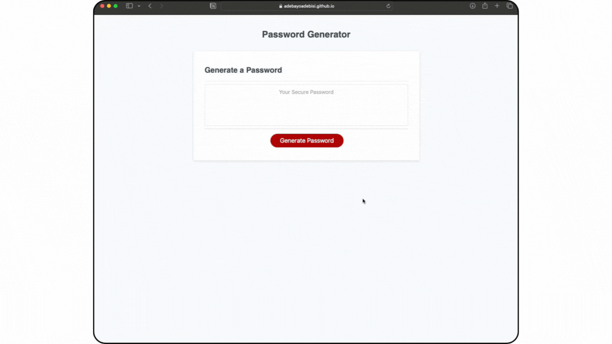

# 05 Password Generator Challenge

# Password Generator

## Description
This activity requires the creation of an application that an employee can use to generate a random password based on the various criteria they’ve selected. The app will run in the browser, and will feature dynamically updated HTML and CSS powered by JavaScript code. It will have a clean and polished user interface that is responsive, ensuring that it adapts to multiple screen sizes even for sizes less than 394px.

## User Story
AS a new employee setting up my secure company profile I WANT to randomly generate a password that meets the company’s security criteria SO THAT I can access the companies intranet securely.

## Acceptance Criteria
- GIVEN I need a new, secure password
- WHEN I click the button to generate a password
- THEN I am presented with a series of prompts for password criteria 
- WHEN prompted for password criteria 
- THEN I select which criteria to include in the password 
- WHEN prompted for the length of the password 
- THEN I choose a length of at least 8 characters and no more than 128 characters 
- WHEN prompted for character types to include in the password 
- THEN I choose lowercase, uppercase, numeric, and/or special characters 
- WHEN I answer each prompt 
- THEN my input should be validated and at least one character type should be selected 
- WHEN all prompts are answered 
- THEN a password is generated that matches the selected criteria 
- WHEN the password is generated 
- THEN the password is either displayed in an alert or written to the page.

## Password Generator Application
The following images shows the Password Generator  displaying a working application.

> **Note** This is a screenshot of the deployed Password Generator.

> **Note** This is a video of the Password Generator showing all the required criteria.

## References
[MDN Web Docs - While Loop](https://developer.mozilla.org/en-US/docs/Web/JavaScript/Reference/Statements/while)

[MDN Web Docs - parseInt()](https://developer.mozilla.org/en-US/docs/Web/JavaScript/Reference/Global_Objects/parseInt)

[MDN Web Docs - Object](https://developer.mozilla.org/en-US/docs/Web/JavaScript/Reference/Global_Objects/Object)

[MDN Web Docs - Math.floor()](https://developer.mozilla.org/en-US/docs/Web/JavaScript/Reference/Global_Objects/Math/floor)

[MDN Web Docs - Array.prototype.join()](https://developer.mozilla.org/en-US/docs/Web/JavaScript/Reference/Global_Objects/Array/join)

## License
Licensed under the MIT License

## GitHub Repository
URL: https://github.com/adebayoadebisi/05-password-generator 

## Deployed Web Application
URL: https://adebayoadebisi.github.io/05-password-generator/
